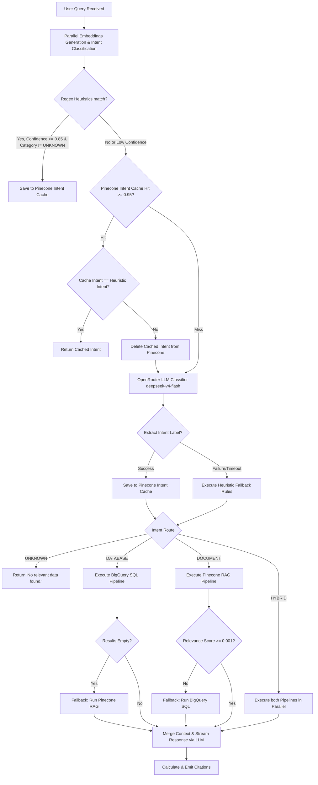

# Query Routing Pipeline & Retrieval Architecture

This document provides a comprehensive technical overview of the query routing, classification, orchestration, and service-level retrieval mechanisms in the Analysis AI system. 

---

## 1. Architectural Blueprint

When a user submits a query to the assistant, the request proceeds through a highly structured pipeline designed to minimize latency, optimize LLM context size, and ensure high-accuracy responses by selecting the most appropriate data sources (BigQuery, Pinecone document store, or both).



---

## 2. Classification Engine (`apps/web/src/core/pipeline/classifier.ts`)

The classification engine analyzes the user's natural language input and maps it into one of four categories:
*   `DATABASE`: Quantitative and aggregation questions (e.g., averages, sums, counts) answered via SQL.
*   `DOCUMENT`: Qualitative and fact-based queries extracted from static reports, contract briefs, or marketing campaigns.
*   `HYBRID`: Complex cross-referencing queries that combine document assertions (targets/plans) with database statistics (actuals).
*   `UNKNOWN`: Out-of-scope, casual, or non-business queries.

The execution proceeds through five phases in [classifyIntentFull](file:///c:/Coding/rough/analysis-ai/apps/web/src/core/pipeline/classifier.ts#L27):

### Phase 1: Pre-Checks & Empty Validation
If the user query is empty, undefined, or contains only whitespace, the pipeline bypasses downstream checks and immediately returns `HYBRID` with `confidence: 1.0` and `stage: "heuristic"`.

### Phase 2: Regex Heuristics (`classifierHeuristics.ts`)
The system evaluates the query string against a list of 96 pre-defined regular expressions in [classifierHeuristics.ts](file:///c:/Coding/rough/analysis-ai/apps/web/src/core/pipeline/classifierHeuristics.ts). Each rule specifies a regex pattern, an intent category, a matching weight (acting as confidence), and a unique rule name.

*   **Scoring & Conflict Resolution**:
    1.  The system calculates the highest matched weight for each of the four categories.
    2.  If any pattern matching `HYBRID` is triggered, the system immediately routes to `HYBRID`.
    3.  If `UNKNOWN` matches with a score $\ge 0.8$, the system routes to `UNKNOWN`.
    4.  If multiple distinct categories have active matches, they are sorted descending. If the second-highest score is $\ge 0.7$, the classification resolves to `HYBRID` (both) with a confidence score equal to the minimum of the two category scores (`Math.min(topScore, secondScore)`).

### Phase 3: Semantic Cache Lookup (`intentCacheService.ts`)
To minimize LLM costs and latency, the system maintains a vector-based intent cache inside Pinecone under the namespace `"intent-routing-cache"`.
1.  The query embedding is computed via [embed](file:///c:/Coding/rough/analysis-ai/apps/web/src/server/clients/embeddingClient.ts).
2.  The cache is queried using [getCachedPineconeIntent](file:///c:/Coding/rough/analysis-ai/apps/web/src/server/services/intentCacheService.ts).
3.  If a match is found with a cosine similarity score **$\ge 0.95$**, it is treated as a hit.
4.  **Cache Poisoning Invalidation**: If the cached intent conflicts with the local regex heuristic classification, or if no regex heuristic is matched (i.e. `heuristic` is null/undefined), the entry is invalidated and removed from Pinecone via [deleteCachedPineconeIntent](file:///c:/Coding/rough/analysis-ai/apps/web/src/server/services/intentCacheService.ts). If they agree, the cached intent is returned immediately with `confidence: 0.95` and `stage: "cache"`.

### Phase 4: LLM Classification
If the heuristic confidence is low ($< 0.85$) or a cache miss/invalidation occurs, the system invokes the LLM:
*   **Model**: `deepseek/deepseek-v4-flash` via OpenRouter.
*   **Settings**: `temperature: 0.0`, `max_tokens: 4000`, `timeout: 8000ms`.
*   **Output Parsing**: The response text is mapped in [extractLabel](file:///c:/Coding/rough/analysis-ai/apps/web/src/core/pipeline/classifier.ts#L18) to extract a single category label. Upon success, the result is saved to the Pinecone semantic cache and returned with `confidence: 0.85`.

### Phase 5: Fallbacks
If the LLM call times out or throws an error, [fallbackResult](file:///c:/Coding/rough/analysis-ai/apps/web/src/core/pipeline/classifier.ts#L127) resolves the classification:
1.  If the heuristic classification returned a confidence score $\ge 0.5$, it uses that intent (but converts `UNKNOWN` to `HYBRID` to avoid false negatives) and scales the confidence down: `heuristic.confidence * 0.8`.
2.  If the heuristic confidence was $< 0.5$, the pipeline defaults to `HYBRID` with `confidence: 0.5`.

---

## 3. Orchestration & Coordination (`apps/web/src/core/pipeline/orchestrator.ts`)

The orchestrator manages the parallel execution of data retrieval pathways, performs cross-pipeline fallbacks, merges the retrieved contexts, stream-generates the final answer, and formats citations.

### A. Routing and Fallback Execution
The routing is driven by the classified intent as follows:

| Intent Category | Direct Execution Path | Fallback / Recovery Logic |
| :--- | :--- | :--- |
| **`DATABASE`** | Runs BigQuery pipeline `execBq()` | If SQL execution returns 0 rows, it triggers the document store RAG pipeline `execDoc()` as a fallback. |
| **`DOCUMENT`** | Runs Pinecone RAG pipeline `execDoc()` | If document search returns no chunks or the highest chunk relevance score is $< 0.001$, it triggers the BigQuery SQL pipeline `execBq()` as a fallback. |
| **`HYBRID`** | Runs both `execDoc()` and `execBq()` in parallel using `Promise.all`. | No fallback logic is executed; both sources are combined. |

### B. Context Merging and LLM Generation
1.  **Extract Contexts**:
    *   `docContext` is extracted if documents met the relevance threshold (minimum score $0.001$).
    *   `bqText` is built via [buildBqText](file:///c:/Coding/rough/analysis-ai/apps/web/src/core/pipeline/orchestrator.ts#L64) consisting of a row-by-row string preview of up to 15 rows and the executed SQL statement.
2.  **Combine Context**: The parts are concatenated: `const mergedContext = parts.join("\n\n")`. If both are empty, the orchestrator outputs `No relevant data found.` and terminates.
3.  **Stream Generation**: The combined sources are injected into the system prompt:
    ```text
    You are Analysis AI. Answer ONLY using the sources below. Use inline citations like [1], [2] referencing source indices. If a database query successfully returned 0 rows, state that no records match the criteria rather than saying "No relevant data found." If no source answers the question, say "No relevant data found." Do not make up information.
    ```
    The answer is streamed back via [processChatWithMessagesStream](file:///c:/Coding/rough/analysis-ai/apps/web/src/server/services/chatService.ts).

### C. Citation Resolution
The orchestrator identifies reference tags (e.g. `[1]`, `[2]`) in the generated response:
*   Indexes `1` through `N` correspond to the RAG document chunks in descending order of relevance.
*   Index `N + 1` corresponds to the BigQuery database results.
*   Citations are dynamically compiled and emitted as a structured payload to the client.

---

## 4. Service-Level Retrieval & Execution

### A. Document Retrieval (RAG Pipeline)
*   **Vector Search**: The user query is embedded and Pinecone is searched to retrieve up to 40 candidate chunks.
*   **Reranking**: Candidate chunks are evaluated by a reranking model: `rerank(message, rerankDocs, 3)`. The top 3 chunks are selected.
*   **Graceful Degradation**: If the reranker fails or is unavailable, the pipeline falls back to sorting by the raw Pinecone vector similarity score.

### B. BigQuery SQL Execution
BigQuery queries are routed through [executeBqQuestion](file:///c:/Coding/rough/analysis-ai/apps/web/src/server/services/bigqueryService.ts#L74):
1.  **Semantic SQL Cache Check**: It checks `sql-cache.json` using the query embedding. If a previously answered query has a similarity $\ge 0.95$, the cached SQL executes immediately, bypassing generation.
2.  **Semantic Table Selection**: Rather than feeding all table schemas to the LLM, the system selects relevant tables semantically using embeddings stored in the `"bq-schemas"` Pinecone namespace.
3.  **Few-Shot Examples**: Relevant natural language queries and their validated SQL counterparts are retrieved from the `"golden-queries"` Pinecone namespace.
4.  **SQL Generation**: The SQL is generated via OpenRouter (primary model: `cohere/north-mini-code:free`).
5.  **Strict Business Rules**: Prompts enforce retail database constraints (e.g. filtering order revenues by status `delivered` or `shipped`, calculating profit margin via order item values, and using tie-breaking ranks rather than strict `LIMIT 1`).
6.  **Auto-Correction Loop**: If BigQuery throws an execution or syntax error, the orchestrator captures the error and submits it to a fallback model (`deepseek/deepseek-v4-flash`) along with the original generation details to self-correct and execute again.
